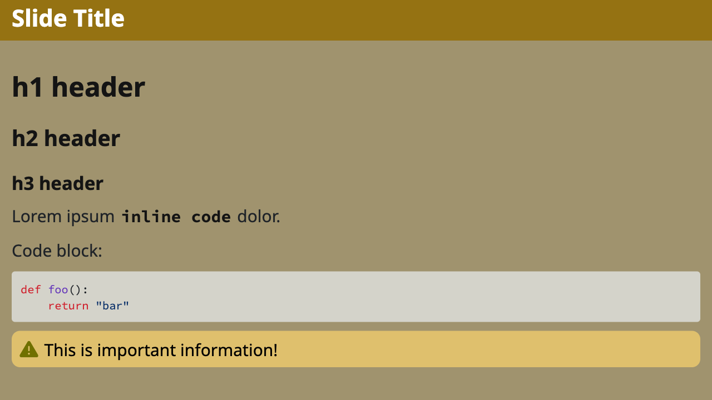

# Marp Clean Theme

This theme provides a clean and simple design for your Marp presentations. It is designed to be easy
to read and visually appealing, with a focus on clean typography and layout.

## Customizations

Several visual customizations are available to change the look and feel of this theme.

Glossary of terms used to describe customizations:
- **title** - the title of the slide, and the title of the presentation
- **subtitle** - the subtitle of the slide. This is optional, created with a `<div
  class="subtitle">` tag. If present, it is drawn immediately below the slide title.
- **content** - the main content of the slide. This is the text that appears in the body of the slide.
- **footer** - the footer of the slide. This is optional, created with a `footer` directive in the
  presentation preamble. If present, the footer is drawn at the very bottom of the slide.
- **page number** - the page number of the slide. This is optional, created with a `paginate`
  directive in the preamble of the presentation (can also be controlled per slide, see the Marpit
  documentation). If present, the page number is drawn at the bottom right of the slide.
- **inline code** - code that is inline with the text. Inline code is delimited with single
  backticks.
- **block code** - code that is in a block. Block code is delimited with triple backticks. 
- **note** - a note that appears on the slide. This is optional, created with a `<div class="note">` tag.

Text can be changed by setting the following CSS variables:
- The base font size of the entire presentation can be changed by setting `--font-size`. Changing
  this one variable will cause all text to be larger or smaller. The default is `24px`. Individual
  text sizes can be change by setting their scaling values (see below). These scale factors are
  all relative to the base font size.
- The size of title text can be changed by setting `--title-font-scale`. The default is `1.4`.
- The size of subtitle text can be changed by setting `--subtitle-font-scale`. The default is `0.8`.
- The size of slide content can be changed by setting `--content-font-scale`. The default is `1.0`.
- The size of page numbers can be changed by setting `--page-number-font-scale`. The default is `0.7`.
- The size of footer text can be changed by setting `--footer-font-scale`. The default is `0.7`.
- The size of note text can be changed by setting `--note-font-scale`. The default is `1.0`.
- The size of inline code can be changed by setting `--code-font-scale`. The default is `1.0`.
- The size of block code can be changed by setting `--code-block-font-scale`. The default is `0.68`.
- The inline code font weight can be changed by setting `--inline-code-weight`. The default is
  `650`, to make inline code stand out just a bit more than normal text. This value can be set
  between `400` and `750` in increments of `50`.
- The weight of block code can be changed by setting `--code-weight`. The default is `400`. This
  value can be set between `400` and `750` in increments of `50`.

Colors can be change by setting the following CSS variables:
- The primary accent color can be changed by setting the `--primary-accent-color` CSS variable. This
  color is used as the background color for titles.
- The slide background color can be changed by setting the `--background-color` CSS variable.
- The inline code background color can be changed by setting the `--inline-code-background-color`
  CSS variable.
- The inline code text color can be changed by setting the `--inline-code-color` CSS variable.
- The block code background color can be changed by setting the `--code-background-color` CSS variable.
- The note background color can be changed by setting the `--note-background-color` CSS variable.
- The note accent color can be changed by setting the `--note-accent-color` CSS variable. This controls
  the color of the note icon.
- The note text color can be changed by setting the `--note-color` CSS variable.
- The subtitle color can be changed by setting the `--subtitle-color` CSS variable.
- The page number color can be changed by setting the `--page-number-color` CSS variable.
- The footer background color can be changed by setting the `--footer-background-color` CSS variable.
- The footer text color can be changed by setting the `--footer-color` CSS variable.

Miscellaneous customizations:
- The note icon can be changed by setting the `--note-icon` CSS variable. The value of this variable
  should be a unicode character. The default is `'\f256'`, which is the Font Awesome icon for a
  triangle with an exclamation point. Use any FontAwesome code point here, or set to the empty string
  to remove the icon.

These customizations give you a lot of flexibility to personalize the look and feel of your slides
while still using this clean theme.

All of these customizations can be done in the `style` section within the preamble of your Marp
markdown file, by setting variables in the `:root` object. Example (taken from the
`examples/clean_customized.md` file):

```markdown
---
marp: true
theme: clean
size: 16:9
paginate: true
footer: 2036 ACM Conference on Slide Formatting
style: |
  :root {
    --primary-accent-color: #208070;
    --background-color: #a0c0c0;
    --inline-code-background-color: #e0e0e0;
    --inline-code-color: #006030;
    --inline-code-weight: 400;
    --code-background-color: #c0f0c0;
    --note-background-color: #f0a0a0;
    --note-accent-color: #802000;
    --note-icon: '\f256';
    --subtitle-color: #208070;
    --page-number-color: #208070;
    --footer-background-color: #a0c0c0;
    --footer-color: #208070;
    --content-font-scale: 0.8;
    --title-font-scale: 1.4;
    --subtitle-font-scale: 0.8;
  }
---
```

## Example Screenshots

Default:

[](../examples/clean.md?plain=1)

Custom colors with smaller font size all around:

[](../examples/clean_smaller.md?plain=1)

Custom colors with bigger font size all around:

[](../examples/clean_bigger.md?plain=1)

More customized:

[](../examples/clean_customized.md?plain=1)